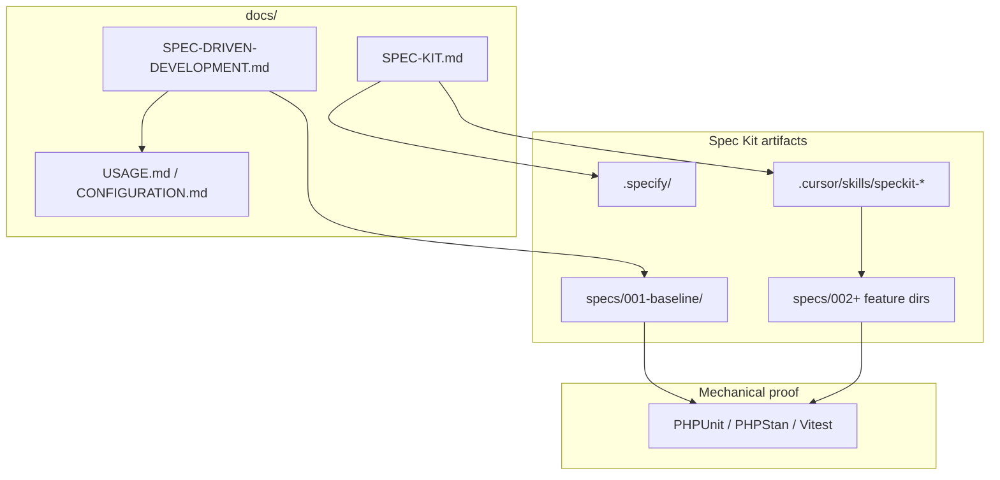

# GitHub Spec Kit — installation, structure, and usage

This manual explains how **GitHub Spec Kit** is set up and used in this repository. It complements [`SPEC-DRIVEN-DEVELOPMENT.md`](SPEC-DRIVEN-DEVELOPMENT.md) (product behavior and traceability) and the normative baseline under [`specs/001-baseline/`](../specs/001-baseline/).

**Official upstream docs:** [github/spec-kit](https://github.com/github/spec-kit) · [Spec Kit documentation](https://github.github.io/spec-kit/)

---

## Table of contents

- [What Spec Kit adds](#what-spec-kit-adds)
- [Prerequisites — install Specify CLI](#prerequisites--install-specify-cli)
- [Initialize Spec Kit in this repository](#initialize-spec-kit-in-this-repository)
- [Folder and document structure](#folder-and-document-structure)
- [How the layers fit together](#how-the-layers-fit-together)
- [Baseline backfill (`specs/001-baseline/`)](#baseline-backfill-specs001-baseline)
- [Using Spec Kit in Cursor Agent](#using-spec-kit-in-cursor-agent)
- [Incremental features (`002+`)](#incremental-features-002)
- [Maintainer checklist](#maintainer-checklist)
- [Troubleshooting](#troubleshooting)
- [See also](#see-also)

---

## What Spec Kit adds

GitHub Spec Kit is a **spec-driven development toolkit**. In Nowo bundles it provides:

1. **Versioned scaffolding** (`.specify/`, Cursor skills) so every repo uses the same workflow.
2. **Baseline specifications** (`specs/001-baseline/`) that document **100% of production code** under `src/`.
3. **Cursor Agent skills** (`/speckit-specify`, `/speckit-plan`, …) to author new feature specs, plans, and tasks consistently.

Spec Kit does **not** replace PHPUnit, PHPStan, or integrator docs — it **anchors** them.

---

## Prerequisites — install Specify CLI

Install the **official** Specify CLI from GitHub (do not use unrelated PyPI packages named `specify-cli`).

**Option A — persistent install (recommended for maintainers):**

```bash
uv tool install specify-cli --from git+https://github.com/github/spec-kit.git
specify --version
```

**Option B — one-off via uvx:**

```bash
uvx --from git+https://github.com/github/spec-kit.git specify --version
```

Verify:

```bash
specify check
```

You should see **Cursor** listed as an available integration (`cursor-agent`).

---

## Initialize Spec Kit in this repository

Run from the **repository root** (same level as `composer.json`):

```bash
specify init --here --force --integration cursor-agent --script sh
```

| Flag | Purpose |
| --- | --- |
| `--here` | Initialize inside the existing repo (no new directory) |
| `--force` | Merge into a non-empty tree without prompts |
| `--integration cursor-agent` | **Cursor Agent** (mandatory for Nowo bundles) |
| `--script sh` | POSIX shell helper scripts (Linux/macOS/WSL) |

In CI or headless shells, add `--ignore-agent-tools`.

**Verify after init:**

```bash
specify integration list
```

Expected: **Cursor** (`cursor-agent`) → `installed (default)`.

Expected files:

- `.specify/init-options.json` — `"integration": "cursor-agent"`
- `.cursor/skills/speckit-specify/SKILL.md` (and sibling skills)
- `.specify/memory/constitution.md` — replace template placeholders with bundle-specific principles

**Re-init** (refresh skills/templates after upgrading Specify CLI):

```bash
specify init --here --force --integration cursor-agent --script sh
```

Existing `constitution.md` and `specs/` are preserved when possible; review the diff before committing.

---

## Folder and document structure

```
Repository root/
├── .specify/                    # Spec Kit infrastructure (templates, scripts, metadata)
│   ├── init-options.json        # Integration: cursor-agent, script: sh
│   ├── integration.json         # Installed integrations
│   ├── memory/
│   │   └── constitution.md      # Project principles (bundle-specific)
│   ├── scripts/bash/            # Helper scripts used by skills
│   ├── templates/               # spec.md, plan.md, tasks.md templates
│   └── workflows/               # Bundled speckit workflow
├── .cursor/
│   ├── mcp.json                 # Engram MCP (REQ-IDE-001)
│   ├── rules/                   # Cursor rules pack (REQ-IDE-003)
│   └── skills/
│       └── speckit-*/           # Cursor Agent skills (/speckit-specify, …)
├── specs/                       # Written specifications (product content)
│   ├── 001-baseline/
│   │   ├── spec.md              # Full-product baseline spec
│   │   └── code-inventory.md    # 100% src/ file → FR-* mapping
│   ├── 002-my-feature/          # (future) incremental feature specs
│   │   ├── spec.md
│   │   ├── plan.md
│   │   └── tasks.md
│   └── …
└── docs/
    ├── SPEC-DRIVEN-DEVELOPMENT.md   # Product behavior + REQ-* traceability
    ├── SPEC-KIT.md                  # This manual
    ├── USAGE.md                     # Integrator usage
    └── CONFIGURATION.md             # Integrator configuration
```

### `.specify/` vs `specs/` — do not confuse them

| Path | Role |
| --- | --- |
| **`.specify/`** | **How** to work — templates, scripts, constitution template, integration metadata. Created by `specify init`. |
| **`specs/`** | **What** the product does — actual specifications you write and version. Baseline lives in `001-baseline/`; new features get `002-`, `003-`, … |
| **`docs/SPEC-DRIVEN-DEVELOPMENT.md`** | Human entry point for **behavior**, user stories, validation, and `REQ-*` Makefile anchors. |
| **`docs/SPEC-KIT.md`** | Human entry point for **tooling** — install, init, structure, Cursor usage (this file). |

---

## How the layers fit together



When you change **product behavior**:

1. Update `specs/001-baseline/spec.md` (or the relevant `00N-feature/` spec).
2. Update `specs/001-baseline/code-inventory.md` if files were added or removed under `src/`.
3. Update `docs/USAGE.md` / `docs/CONFIGURATION.md` when integrators must act.
4. Add or adjust **tests** — specs alone are not sufficient proof.

---

## Baseline backfill (`specs/001-baseline/`)

Every Nowo bundle with Spec Kit must ship:

| File | Content |
| --- | --- |
| `spec.md` | User scenarios, `FR-*` requirements, success criteria (`SC-*`), non-goals, validation commands |
| `code-inventory.md` | Table mapping **every production file** under `src/` to spec sections and `FR-*` IDs |

**Production code scope:** all files under `src/` that ship with the package (PHP, TS/JS, SCSS, YAML config, Twig views, translations). Exclude `tests/`, `demo/`, `*.test.ts`, and generated caches. Build artifacts (`dist/`) are documented as **outputs** of named sources.

**Audit command (maintainers):**

```bash
find src -type f ! -path '*/assets/dist/*' ! -name '*.test.ts' | wc -l
```

The **Total production sources** row in `code-inventory.md` must match this count.

In **YopassBundle**, the baseline inventory covers **68/68** files — see [`specs/001-baseline/code-inventory.md`](../specs/001-baseline/code-inventory.md).

---

## Using Spec Kit in Cursor Agent

Open the repository in **Cursor** and use **Cursor Agent** in the project root. Spec Kit installs skills under `.cursor/skills/`; invoke them as slash commands in the agent chat.

### Core workflow (new feature)

Typical order for a **new feature** (not the baseline backfill):

| Step | Skill | Purpose |
| ---: | --- | --- |
| 1 | `/speckit-constitution` | Align or update `.specify/memory/constitution.md` |
| 2 | `/speckit-specify` | Create or update `specs/NNN-feature-name/spec.md` from a natural-language description |
| 3 | `/speckit-clarify` | *(optional)* Resolve ambiguities before planning |
| 4 | `/speckit-plan` | Generate `plan.md` (technical approach) |
| 5 | `/speckit-checklist` | *(optional)* Quality checklist after plan |
| 6 | `/speckit-tasks` | Break down into `tasks.md` |
| 7 | `/speckit-analyze` | *(optional)* Cross-artifact consistency check |
| 8 | `/speckit-implement` | Execute tasks with the agent |
| 9 | `/speckit-converge` | Compare codebase vs artifacts; append remaining work |

### Example — start a feature spec

In Cursor Agent chat:

```text
/speckit-specify Add optional overlay filter persistence via localStorage
```

The skill creates (or updates) a directory such as `specs/002-overlay-filter-persistence/spec.md` using templates from `.specify/templates/`.

### Example — baseline maintenance (manual)

For **documenting existing code** (baseline), maintainers typically **edit directly**:

- [`specs/001-baseline/spec.md`](../specs/001-baseline/spec.md)
- [`specs/001-baseline/code-inventory.md`](../specs/001-baseline/code-inventory.md)

Use `/speckit-converge` to find gaps between specs and code after large refactors.

### Skills reference

| Skill | When to use |
| --- | --- |
| `/speckit-constitution` | Establish or amend project principles |
| `/speckit-specify` | New or updated feature specification |
| `/speckit-plan` | Implementation plan from spec |
| `/speckit-tasks` | Actionable task list from plan |
| `/speckit-implement` | Execute implementation tasks |
| `/speckit-converge` | Post-implementation gap analysis |
| `/speckit-clarify` | Before plan — reduce ambiguity |
| `/speckit-analyze` | After tasks — consistency report |
| `/speckit-checklist` | After plan — requirements quality |
| `/speckit-taskstoissues` | Export tasks to GitHub issues |

---

## Incremental features (`002+`)

| Directory | Role |
| --- | --- |
| `specs/001-baseline/` | **Authoritative full-product** backfill; must not be contradicted by later specs |
| `specs/002-feature-name/` | Single feature: `spec.md`, optionally `plan.md`, `tasks.md`, checklists |
| `specs/003-…` | Next feature (sequential numbering) |

Feature specs are created by `/speckit-specify` (sequential numbering is automatic unless you set `SPECIFY_FEATURE_DIRECTORY`).

When a feature ships:

1. Merge behavior into or reference from `001-baseline` if it becomes core product surface.
2. Update `code-inventory.md` for new `src/` files.
3. Update integrator docs and tests.

---

## Maintainer checklist

Before merging a PR that changes production code:

- [ ] `specs/001-baseline/code-inventory.md` includes every new/changed production file under `src/`
- [ ] `specs/001-baseline/spec.md` (or feature spec) describes behavior with `FR-*` / `SC-*` IDs
- [ ] `docs/SPEC-DRIVEN-DEVELOPMENT.md` still accurate for user stories and scope
- [ ] `docs/USAGE.md` / `docs/CONFIGURATION.md` updated if integrators are affected
- [ ] Tests and static analysis pass (`composer qa`, etc.)
- [ ] `.specify/memory/constitution.md` updated if principles changed

Before migrating a **new bundle** to Spec Kit:

- [ ] Install Specify CLI
- [ ] `specify init --here --force --integration cursor-agent --script sh`
- [ ] Create `specs/001-baseline/{spec.md,code-inventory.md}`
- [ ] Tailor `constitution.md`
- [ ] Add this manual (`docs/SPEC-KIT.md`) and extend `docs/SPEC-DRIVEN-DEVELOPMENT.md`
- [ ] Link **GitHub Spec Kit** from root `README.md` `## Documentation` (see org checklist)

---

## Troubleshooting

| Problem | Action |
| --- | --- |
| `Unknown integration: 'cursor'` | Use `cursor-agent`, not `cursor`: `--integration cursor-agent` |
| Skills missing in Cursor | Re-run `specify init --here --force --integration cursor-agent --script sh`; confirm `.cursor/skills/speckit-specify/` exists |
| `specify integration list` shows Cursor not installed | Run init from repo root; check `.specify/integration.json` |
| Agent cannot find `.specify/` | Open Cursor at **repository root**, not a subfolder |
| Baseline count mismatch | Re-run inventory audit; update `code-inventory.md` summary row |

---

## See also

- [`SPEC-DRIVEN-DEVELOPMENT.md`](SPEC-DRIVEN-DEVELOPMENT.md) — product behavior and `REQ-*` traceability
- [`specs/001-baseline/spec.md`](../specs/001-baseline/spec.md) — baseline functional spec
- [`specs/001-baseline/code-inventory.md`](../specs/001-baseline/code-inventory.md) — 100% code map
- [`.specify/memory/constitution.md`](../.specify/memory/constitution.md) — project principles
- [GitHub Spec Kit documentation](https://github.github.io/spec-kit/) — upstream Specify CLI and skills reference
